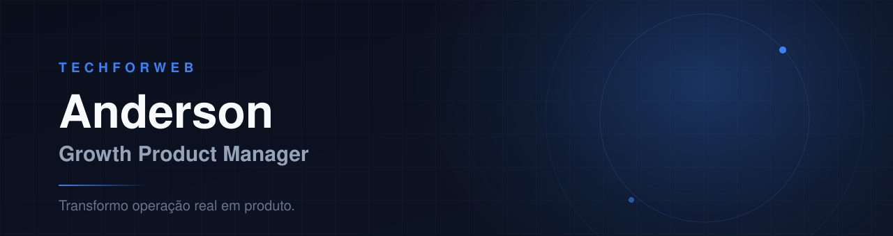

 

  

 

Meu ponto de partida quase nunca é uma tela: é um processo manual, uma planilha
que ninguém confia ou um dado que não fecha. A partir daí venho construindo
produtos de e-commerce, marketplace, dados, IA aplicada e pagamentos.

**Growth Product Management** · Product Discovery · SaaS · IA aplicada ·
Data & Growth Intelligence · E-commerce e marketplace

 

> ### Por que os repositórios são privados
>
> A maior parte do que construo roda para operações reais — com dados de
> clientes, integrações de marketplace e regras fiscais. Por isso o código fica
> fechado.
>
> O que dá para mostrar está aqui: o problema que cada produto resolve, a decisão
> de produto por trás dele e o link para o que está no ar. O detalhe de
> arquitetura e decisão está escrito em **[techforweb-cases](https://github.com/Storepac/techforweb-cases)**.

 

## Cases principais

| | Produto | Problema que resolve | Status |
|:--|:--|:--|:--|
| 🧩 | **AMK Voke** | Pedidos, estoque, custo, margem e expedição espalhados entre canais, ERP e planilhas |  |
| 📅 | **[AgendaPro](https://agendapro.techforweb.com.br)** | Agendamento que precisava virar SaaS multi-tenant, e não sistema de um cliente só |  |
| 📊 | **NFE-AMK** | DRE e realidade fiscal só visíveis no fechamento, tarde demais para decidir |  |
| 🛒 | **[LojaHub / Catálogo](https://catalogo.techforweb.com.br/)** | Vender por catálogo e WhatsApp sem carregar a complexidade de um e-commerce completo |  |
| 🌱 | **[AMK Assistente IA](https://ia.lojaamk.com.br/assistente-ia)** | Dúvida técnica de jardinagem travando a decisão de compra |  |
| 💳 | **T4W Pay** | Infraestrutura de pagamento white-label para os produtos do estúdio |  |

 em produção, com acesso liberado para um grupo limitado de usuários &nbsp;·&nbsp;  em construção, ainda sem usuários testando

 

## Product Lab

Experimentos para testar verticais, modelos de negócio e hipóteses de produto.

| | Projeto | O que testa | Status |
|:--|:--|:--|:--|
| 🧪 | **[Learning Lab](https://ideias.techforweb.com.br)** | Estudo aplicado com IA como apoio, não como dependência |  |
| 🗺️ | **[XixiMaps](https://xiximaps.techforweb.com.br/landing)** | Utilidade cotidiana virando produto colaborativo, com mapa e reputação |  |
| ✍️ | **[Blog AMK](https://blog.lojaamk.com.br)** | Conteúdo como canal de aquisição para e-commerce |  |
| 🧠 | **[Sâmea Psico](https://samea-psico.vercel.app)** | Presença digital e captação para consultório |  |
| ⚽ | **[ArenaOn](https://arena-on.vercel.app)** | Produto de esportes e comunidade |  |
| 🔍 | **RankIA** | Inteligência de SEO e concorrência para operação própria |  |

 

## Código aberto aqui

**[gerador-ideias](https://github.com/Storepac/gerador-ideias)** — o Learning Lab
inteiro. Next.js 15, React 19 e Gemini com guardrails de custo: cota diária por
navegador, limite por IP e kill switch por variável de ambiente. Feito para
estudar e para quem quiser estudar junto.

**[techforweb-cases](https://github.com/Storepac/techforweb-cases)** — estudos de
caso em markdown: problema, decisão de produto, arquitetura e aprendizado. Sem
código-fonte, só o raciocínio.

 

## Stack

         

 

Herculândia · SP · Brasil 
Aberto a conversar sobre produto, growth e operação — <a href="https://techforweb.com.br">techforweb.com.br</a>

